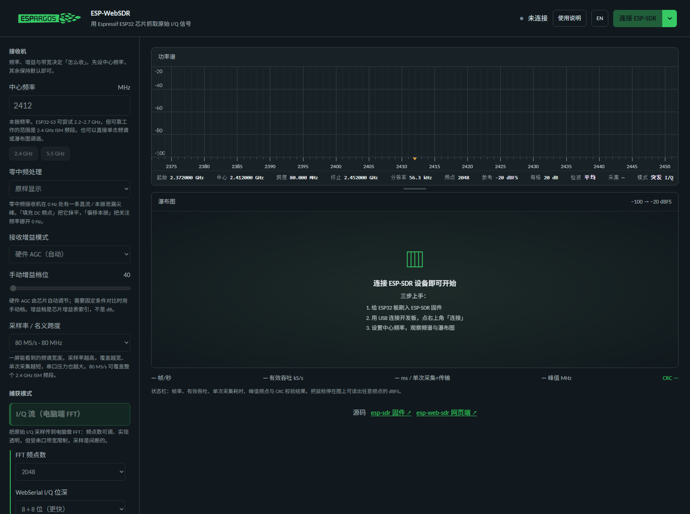
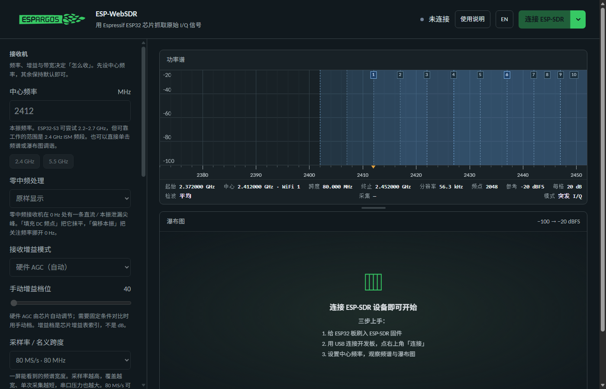
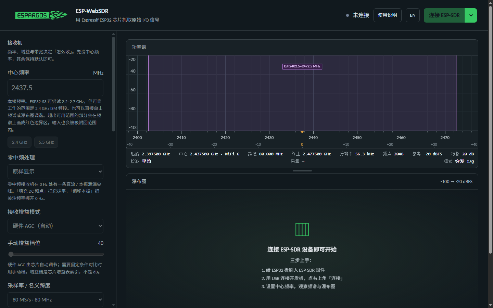

# ESP-WebSDR 中文增强版（在线版）

浏览器里直接用的 ESP-SDR 频谱查看器，**全中文界面**。

**在线地址：<https://www.248632.xyz/sdr/>**

> 这是上游 [ESPARGOS/esp-web-sdr](https://github.com/ESPARGOS/esp-web-sdr)（官方地址 `https://espargos.net/espsdr/app/`）的中文增强副本。
> 上游以 **GPL-3.0-or-later** 发布，本副本为同许可证下的修改版，`LICENSE` 保持原样。

## 怎么用

1. 用**桌面版 Chrome / Edge / Firefox** 打开 <https://www.248632.xyz/sdr/>（Web Serial 只有桌面版 Chromium 系与 Firefox 支持）。
2. USB 插上刷好 ESP-SDR 固件的 ESP32（S3 / S2 / C5 / C6 / C3 / C2 / H2 等）。
3. 点「连接设备」，在浏览器弹窗里选中串口，然后按需调采样率 / 模拟带宽 / FFT 频点数。

固件还没刷？同一个目录里有刷写器：**<https://www.248632.xyz/sdr/flash.html>**（原样保留上游版本，未做修改）。

必须走 `https://` 或 `http://127.0.0.1`，不能把 `index.html` 下载下来双击打开 —— `file://` 属于非安全上下文，浏览器既不给 Web Serial 也会拦掉 `fetch`，页面会一片空白。

## 相对上游做了什么

| 改动 | 说明 |
| --- | --- |
| 全中文界面 | 默认中文，右上角 `EN` 一键切回英文，选择记在 `localStorage` |
| 每个控件都有说明 | 采样率、带宽、FFT 频点数、增益、零中频处理等控件下面都有中文释义和取舍建议 |
| 「使用说明」面板 | 顶部按钮展开/收起，含*这是什么*、*三步上手*、*参数怎么选*、*重要限制*、*常见问题*、*关于本页*，`Esc` 关闭 |
| 空白状态引导 | 未连接时给出「插上设备 → 点连接 → 选参数」三步清单，而不是只写 `Not connected` |
| 2.4G WiFi 信道覆盖层 | 频谱上按 20 MHz 画出 WiFi 1–14 信道并标号，1/6/11 高亮；可开关，选择会记住 |
| DJI 2.4G 频段标记 | 标出 **2402.5–2472.5 MHz**（DJI 无人机图传/遥控常用的 2.4 GHz 范围）：淡紫底色 + 两侧实线边界 + 区间名；鼠标停在该区间内读数后追加 `· DJI`。可开关，选择会记住 |
| 滤波器陷阱提示 | 「模拟带宽」小于跨度时，提示两侧是接收机自己削掉的、中间台地来自滤波器而非信号 |
| 频率轴双排刻度 | 上排绝对频率，下排相对中心频率的偏移（中心恒为 0，右 + 左 −），缩放后按 1-2-5 重排 |
| 频率输入自动吸附 | 超出芯片/固件可用范围的值会被吸附到最近可用频点并提示，而不是等到发送才报错 |
| 可用范围硬边界 | 在固件上报范围之外再叠一层可尝试范围（S3/S2 为 2200–2700 MHz、S31 为 2300–2800 MHz），频谱上超出部分画成红色边界区 |
| 调谐时平移历史 | 换中心频率时把迹线、最大保持、瀑布图历史按 bin 平移，换频后立刻就是满血的最大保持 |
| 设置记忆 | 中心频率、采样率、FFT 频点数、位深、增益、模拟带宽、平均、底噪/动态范围、检波与瀑布行时间都会记住 |
| 状态与错误中文化 | 面向用户的提示、警告、`Error(...)` 文本都走翻译层，取不到词条时回退上游英文 |

无线电协议、串口时序、DSP、频谱与瀑布图渲染逻辑**一行未改**。

## 目录内容

```
index.html  app.js  radio.js  i18n.js  ui.js  triggers.js   # 查看器
style.css   fonts.css  favicon-*.png  espargos-logo.svg     # 样式与图标
flash.html  flasher/  firmware/                             # 刷写器 + 自包含固件
LICENSE                                                     # GPL-3.0-or-later
screenshots/                                                # 效果图
```

## 效果







## 本地跑

上游仓库的完整开发副本（含 `tests/`、`tools/`、`serve.mjs`）在 <https://github.com/ESPARGOS/esp-web-sdr> 的本地中文分支里；只做本地调试时，用任意静态服务器指向本目录即可：

```bash
python -m http.server 8099     # 然后打开 http://127.0.0.1:8099/
```

## 已知限制

- 少数底层错误文本来自未改动的上游模块（如 `flasher/catalog.mjs`），仍是英文；查看器侧的框架文字已是中文。
- 译文按上游 `main` 分支 `70708ba` 撰写，上游改动文案后可能需要同步更新词典。
